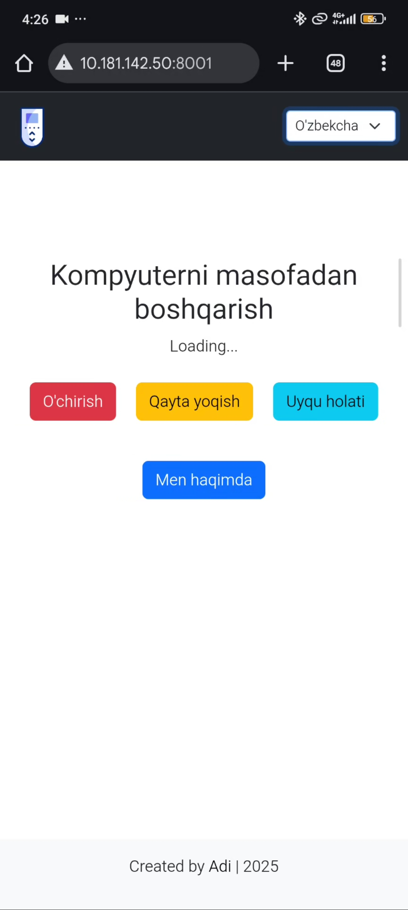

# 🌐 UXLA | Remote PC Agent – FastAPI Web App
<p align="center">

</p>

🎥 Demo videoni ko‘rish:  
[](agent/static/video/uxla-demo.mp4)


## 📖 Loyihaning qisqacha tavsifi

**UXLA | Remote PC Agent** – bu **FastAPI** asosida yaratilgan web ilova bo‘lib, foydalanuvchiga masofadan turib o‘z kompyuterini boshqarish imkoniyatini beradi.

Ilova yordamida quyidagi amallarni bajarish mumkin:

* 💻 Kompyuterni o‘chirish (`shutdown`)
* 🔄 Qayta yuklash (`restart`)
* 😴 Uyqu rejimiga o‘tkazish (`sleep`)
* ℹ️ `About` sahifasida dasturchi haqida ma’lumot ko‘rish

Frontend qismi **Bootstrap 5** yordamida yozilgan bo‘lib, **responsive (mobilga moslashgan)** dizaynga ega.
Shuningdek, ilovaga **ko‘p tilli (i18n)** qo‘llab-quvvatlash qo‘shilgan – foydalanuvchi sahifani Uzbek, English va Deutsch tillarida ko‘rishi mumkin.

---

## 🚀 Texnologiyalar

Quyidagi texnologiyalar asosida ishlab chiqilgan:

* ⚡ [FastAPI](https://fastapi.tiangolo.com/) – backend API framework
* 🌐 [Uvicorn](https://www.uvicorn.org/) – ASGI server
* 🖼️ [Jinja2](https://jinja.palletsprojects.com/) – template engine
* 🎨 [Bootstrap 5](https://getbootstrap.com/) – frontend UI framework
* 📡 [Axios](https://axios-http.com/) – API chaqiriqlar uchun
* 🐍 [Python 3.10+](https://www.python.org/) – dasturlash tili
* 🐳 [Docker](https://www.docker.com/) – konteynerlash va deploy

---

## 📂 Loyihaning struktura

```bash
.
├── agent
│   ├── __init__.py
│   ├── main.py          # FastAPI asosiy konfiguratsiyasi
│   ├── routes.py        # Router va endpointlar
│   ├── commands.py      # OS buyruqlari (shutdown, restart, sleep)
│   ├── templates/       # Jinja2 HTML shablonlari
│   └── static/          # Logo, favicon, CSS, JS, translations.json 
├── tests/               # Unit testlar
├── README.md            # Loyihaning hujjati
├── requirements.txt     # Kerakli kutubxonalar
└── Dockerfile           # Docker konfiguratsiyasi
```

---

## ⚙️ O‘rnatish va ishga tushurish

### 1️⃣ Klonlash

```bash
git clone https://github.com/<your-username>/uxla-remote-agent.git
cd uxla-remote-agent
```

### 2️⃣ Virtual environment (local mode)

```bash
python3 -m venv venv
source venv/bin/activate   # Linux/MacOS
venv\Scripts\activate      # Windows
pip install -r requirements.txt
```

### 3️⃣ Ishga tushurish

```bash
uvicorn agent.main:app --reload
```

👉 Brauzerda oching: `http://127.0.0.1:8000`

---

## 🐳 Docker orqali ishga tushurish

### Build

```bash
docker build -t uxla-agent .
```

### Run

```bash
docker run -d -p 8000:8000 uxla-agent
```

👉 Brauzerda oching: `http://localhost:8000`

---

## 🧪 Testlar

```bash
pytest tests/
```

---


## 👨‍💻 Muallif

**Abdumannon Abdurakhmonov**

[](https://github.com/aabdurakhmanov)

---

⚡ *Agar loyihani foydali deb topsangiz – ⭐ star bosing va fork qiling!*
oldindan rahmat
---
